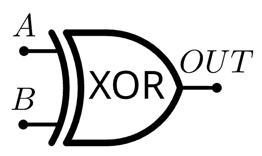

# Altair 8800 Part 1

---

## Introduction & Logic
### :sparkles: *The Mathematical Analysis of Logic* by George Boole :sparkles: 
- showed how logic can be analyzed using simple arithmatic 
- All practical digital computers and many other electrical circuits are based on these concepts
  

### $${\color{blue}Boolean \space Algebra}$$ 
Boolean expressions are the expressions that evaluate a condition and result in a Boolean value 
A logic statement is either **true** :thumbsup: or **false** :thumbsdown:  
- true is represented with a 1, false is represented with a 0
- there are no maybes :x: :x:
  

### Basic Logic
- $${\color{green}AND}$$

|  A  |  B  |  Output  |
|-----|-----|----------|
|  1  |  1  |    1     |
|  1  |  0  |    0     |
|  0  |  1  |    0     |
|  0  |  0  |    0     |
 
---
 
## Electronic Logic

|  A  |  B  |  Output  |
|-----|-----|----------|
|  1  |  1  |    1     |
|  1  |  0  |    1     |                 
|  0  |  1  |    1     |
|  0  |  0  |    0     |

- $${\color{red}NOT}$$  

|  A  |  Output  |
|-----|----------|
|  1  |    0     |
|  0  |    1     |                 

---

## Electronic Logic

### Basic Logic Functions - AND, OR, NOT

### Combination Logic - NAND, NOR, XOR
#### NAND is the combination of AND + NOT
|  A  |  B  |  Output  |
|-----|-----|----------|
|  1  |  1  |    0     |
|  1  |  0  |    1     |
|  0  |  1  |    1     |
|  0  |  0  |    1     |

#### NOT is OR + NOT
|  A  |  B  |  Output  |
|-----|-----|----------|
|  1  |  1  |    0     |
|  1  |  0  |    0     |
|  0  |  1  |    0     |
|  0  |  0  |    1     |

#### XOR is exclusive or (sometimes called a binary adder)
|  A  |  B  |  A+B     |
|-----|-----|----------|
|  1  |  1  |    00     |
|  1  |  0  |    01     |
|  0  |  1  |    01     |
|  0  |  0  |    10     |

---

## Number Systems
- The Altair 8800 uses a positional numeral system in *base-2*
- For engineering and mathematical reasons, most computers are binary digital computers meaning they operate on bits
- bits comes from binary digits -- it is a portmanteau (**b**inary dig**its**) 

### Octal & Hex 
- $2^3$ or $8$ (octal)
    - One digit can go as high as 7 - $111 = 7$
- $2^4$ or $16$ (hexidecimal)
    - One digit can go as high as 15 - $1111 = 15$
- Both can easily map to the binary number system 

| Binary | Decimal | Hex |
|--------|---------|-----|
| 0000   | 0       | 0 |
| 0001   | 1       | 1 |
| 0010   | 2       | 2 |
| 0011   | 3       | 3 |
| 0100   | 4       | 4 |
| 0101   | 5       | 5 |
| 0110   | 6       | 6 |
| 0111   | 7       | 7 |
| 1000   | 8       | 8 |
| 1001   | 9       | 9 |
| 1010   | 10      | A |
| 1011   | 11      | B |
| 1100   | 12      | C |
| 1101   | 13      | D |
| 1110   | 14      | E |
| 1111   | 15      | F |

---

## Binary
- The Altair 8800 preforms nearly all operations in binary
    - A typical binary number processed by the computer incorporates 8-bits (called a byte)
- Counting in any number system is governed by one basic rule: Record successive digits for each count in a column. When the total number of available digits has been used, begin a new column to the left of the first and resume counting
- Each bit in a binary number indicated by which power of two the number is to be raised

