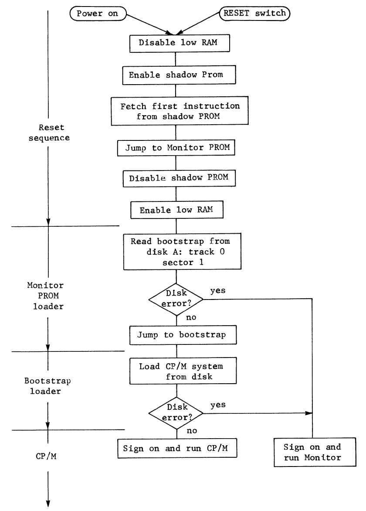
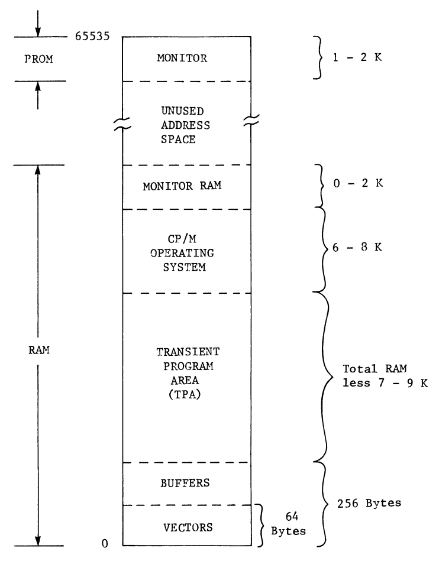

# CPM Chapter 2

## Acronyms
- **ROM** - Read-only memory
- **RAM** - Random access memory
- **CPU** - Central processing unit
- **CP/M** - Control program for Microcomputer
- **PROM** - Programmable Read Only Memory - saves memory even when off - firmware are the instructions in the PROM
- **EPROMS** - Erasable Programmable Read Only Memory
- **DDT** - Dynamic Debugging Tool
- **IOCS** - Inpute/Output Control System
- **TPA** Transient Program Area

## Intro
- To ensure the operating system was loaded properly, a simple short loarder would first read in a smart loader, that would then load the system
    - **Bootstrap**: minimum loader that allowed the system to pull itself up into memory by the bootstrap
- **Semiconductor** memory replaced the core memory
    - semiconductor RAM loses its memory when the power goes down :(
- as **EPROMS** became affordable, switches began disappearing
- **software**: ROMs contained programs, and therefore software
- **firmware** software made harder by being burned into ROM

## Firmware monitor
- low end of main memory address space must contain read-write memory
- Microcomputer had to resort to a hardware trick - a bootup circuit is activated by the same reset signal that starts the CPU
    - This circuit makes the RAM at location zero
    - The CPU tries to pull from RAM but gets redirected to a "shadow PROM"
    - "shadow" because CPU doesn't know about it
- After CPU decodes jump, it goes there and then begins its next instruction fetch sequence by placing the new address on the computer's address bus
    - The **address bus** is the set of sixteen signal lines that contain the bit pattern of the adddres
    - Afterwards the "shadow PROM" gets disabled and RAM is reenabled at the bottom of memory
- When reset is hit, CPU begins fetching instructions from monitor PROM
- **DDT**: provides same function as a monitor in PROM
    - small console that programmer can see
- **Peripheral driver programs**: sub-routines that out program can call, providing us with access to all of the system peripherals

## The operating system
- There isn't a standard for input/output port assignments
- For instance, to transmit a character from the computer to the console, a driver program must test the status of the output port to which the console is attached, to see Software Components of the Computer System 27 if it is ready to accept a character. If not, the driver must wait for a not busy signal. Once the port announces it is ready to accept a character, the driver outputs the character to the console output port.

## Customizing CP/M
- All disk and I/O accesses are passed through a single entry point into the CP/M
- to omplement, function codes are passed in one register and the data or buffer address passed in other registers

## Application programs
- RAM
    - Some of the main memory address space is taken by the firmware monitor & the resident portion of CP/M will take up ~6k
    - Some special areas at the bottom of RAM that are used by the operating system
    - the rest of the memory address sace is for the user
- CP/M loads in RAM in TPA
    - The TPA begins at a fixed address and includes all available RAM not required by CP/M
- While we are in the process of editing, assembling, and debugging our application programs we will be using CP/M's editor (ED), assembler (ASM), loader (LOAD), and debugger (DDT). These programs are also going to be loaded into the TPA as we use them. Obviously, then, they will not reside in memory all at the same time, and only DDT will share main memory with our programs. 
- DDT will have to be loaded along with our application programs only until the programs are fully operational.

## Special memory areas
- Down at the lowest addresses in our computer's RAM are locations
dedicated to vectors.
- vectors are unconditional jump instructions
- Above the space devoted to vectors, CP/M establishes buffer areas that we will be using when we interface our programs with the operating system
    - these areas all take up only 256 locations at the bottom of RAM,
and the TPA begins at the next available location.
- Another special area within RAM may be dedicated to monitor functions. 
    - varies
-  For this reason you will often see a machine running a 46K version of CP/M, for example, when 48K of RAM actually exists. The other 2K, it is safe to assume, was required for other functions

