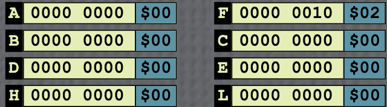

# Chapter 9 - Register Usage in the 8080

---

##  Why Registers Matter

### Reasons for Hardware Registers
1. **Speed** → Registers are inside the CPU, so operations are much faster than accessing memory.  
2. **Portability** → Every CP/M system has at least the standard 8080 registers.  
3. **Convenience** → Multiple register pointers make it easier to handle memory data.

---

##  Register Organization and Data Paths

- **A (Accumulator):** Main input to the ALU.  
- **F (Flag Register):** Stores condition bits after operations:
  - **S** → Sign  
  - **Z** → Zero  
  - **A** → Auxiliary Carry  
  - **P** → Parity  
  - **C** → Carry  

### Register Pairs
- **AF** → Used for stack operations (Program Status Word).  
- **BC, DE, HL** → Can form 16-bit registers for indexing or addressing memory.  
- **SP (Stack Pointer)** and **PC (Program Counter)** → Used for memory addressing only.

---

##  Register Address Codes (Table 9-1)

| Binary | Decimal | Register |
|---------|----------|-----------|
| 000 | 0 | B |
| 001 | 1 | C |
| 010 | 2 | D |
| 011 | 3 | E |
| 100 | 4 | H |
| 101 | 5 | L |
| 110 | 6 | M |
| 111 | 7 | A |

---

##  The M Register

- The **M register** isn’t a physical register—it’s the **memory location** pointed to by the **HL** pair.  
- It allows memory to act like a register, enabling direct operations on memory data.

---

##  Stack Operations

- The **stack** is a memory area managed by the **Stack Pointer (SP)**.  
- It’s used for:
  - Temporary register storage (**PUSH/POP**)
  - Subroutine calls and returns (**CALL/RET**)
  - Interrupts  

 The stack grows **downward** in memory (SP decrements).  
Operates as **LIFO (Last In, First Out)**.

