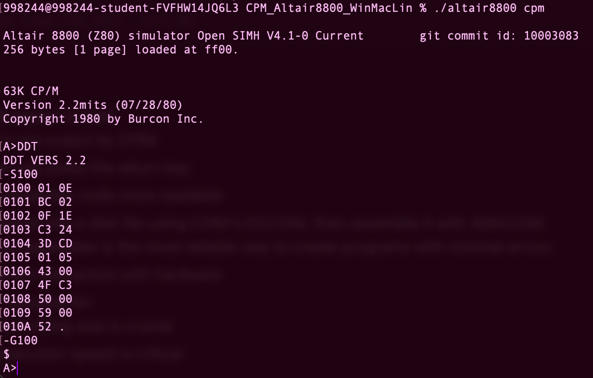

# CPM Introduction

## Steps for installing the enviorment

1. Download [the enviorment here](images/CPM_Altair8800_WinMacLin.tgz)
2. Move the file into your repo
3. Unzip the file
    *if you're on a school mac* run this line in your terminal where the file is: xattr -d com.apple.quarantine altair8800mac
4. You can use "ls" to view the files, there should be several labeled "altair8800"...
5. using "rm" remove the files that aren't your computer type
    *if you're on a school mac* you would delete everything aside from "altair8800mac"
6. use "./altair8800 cpm" to open the enviorment

---

## Running the program

### The text book gives the following code;

A> **DDTcr**
DDT VERS 1.4
-**S100cr**
0100 01 **0Ecr**
0101 B6 **02cr**
0102 OF **1Ecr**
0103 C3 **24cr**
0104 3D **CDcr**
0105 01 **05cr**
0106 43 **00cr**
0107 4F **C3cr**
0108 50 **00cr**
0109 59 **00cr**
010A 52 **.cr**
-**G100cr**
$
A>

- When inputing this into your terminal, know that "cr" means return. So, when typing this in you press the "return" key on your computer instead
- The output is the "$"

### This is what it should look like from a school computer terminal

